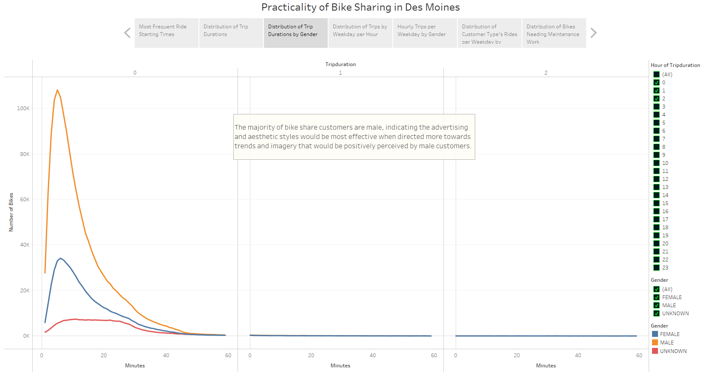
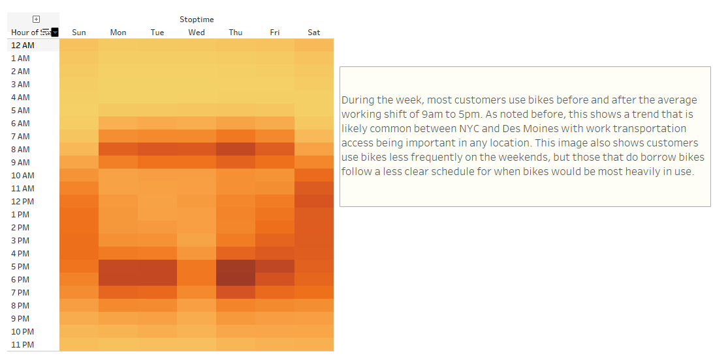

# Assessing The Potential Success of Bike Sharing

### **Files and Links**:
- Trip Data Jupyter Notebook File: [NYC_CitiBike_Challenge](NYC_CitiBike_Challenge.ipynb)
- Bike Sharing Tableau Story: [link to dashboard](https://public.tableau.com/app/profile/harry6074/viz/BikeSharingChallenge_16429889443620/BikeSharingStory)

## **Analysis Overview**:
After seeing the success of the CitiBike bike-sharing service in New York City, the idea of implementing a similar bike-share service in a more local area has intrigued a colleague. Their local area is Des Moines, Iowa, which will inevitably have some differences in the habits and preferences for the local population compared to those in New York City. Based on this expectation, yet still wanting to consider the practicality of introducing such a business in the area, the available data from CitiBike's public records can help provide some insight into which types of customers use bike-sharing services. By combining the tools available through Tableau and the records provided by CitiBike, some key visual representations of the data can show a bike-sharing service will indeed be as useful for people in Des Moines as in New York.

## **Results**:
Some of the key points to be considered when assessing the possibility of starting a bike-sharing service are: basic details about the types of customers that would use the service, an idea of how many bikes would be needed and how often they will be in use throughout the day, and when are the bikes most in use throughout the week. These topics were explained through seven different visual represenations in Tableau by comparing the data values in the CSV file provided by CitiBike. The created visuals were combined into a story through Tableau Public, with a link to the page provided above, and describe the trends in the customers that used the bike-share service. The main conclusions drawn from the data were that most CitiBike customers were male, the majority of trips were less than 30 minutes in duration and customers most frequently borrowed the bikes immediately before and after the average working shift during the week. As shown below, these conclusions were very clearly shown in the visual representations created in Tableau:

- The breakdown of customers by gender showed a very high number of males compared to females and customers who did not report their genders

- The key times for bikes being borrowed were before 9 A.M. and after 5 P.M. on week days and were much less clearly focused on weekends

## **Summary**:
The conclusions drawn from this analysis showed that the biggest trends in the bike-share service did not depend on criteria that would make Des Moines any less likely to be a successful location for bike-sharing. In addition to the main conclusions listed the previous section, the trends in customers not needing bikes for long trips and mostly needing them for key times and in certain key locations compared to others showed a limited number of bikes could be distributed successfully and would be able to quickly be returned by customers after the key borrowing times. These patterns show that as long as a sufficient number of bikes are available in these key locations at the key times, they could be redistributed when not as often in use and maintained in the off times without much impact on customer satisfaction. With the helpful visual depictions of these trends through Tableau, the data shows confidently that a bike-share service would work well in a city like Des Moines as well as New York City.

